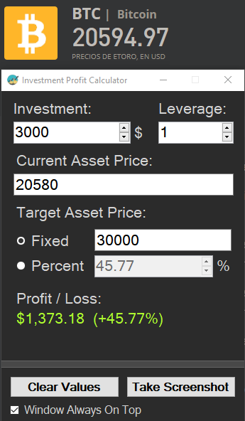
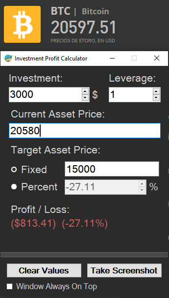
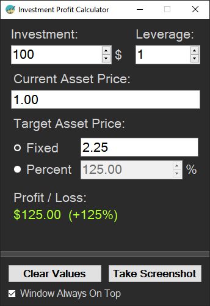

<!-- Common Project Tags:
desktop-app 
desktop-application 
dotnet 
netframework 
netframework48 
tool 
tools 
vbnet 
visualstudio 
windows 
windows-app 
windows-application 
windows-applications 
windows-forms 
winforms 
 -->

  
  
  <h1>Investment Profit & Loss Calculator</h1>

### A simple and basic Profit & Loss (P&L) calculator for your asset investments.

------------------

    &nbsp;
    &nbsp;
    &nbsp;
    
    &nbsp;
    
   
   
    
    
    
    
    
    
   
    
    
    
    
    
    
   
   
    

------------------

## 👋 Introduction

This project is a simple and basic Windows desktop application built with WinForms and VB.NET. It acts as an easy-to-use utility to quickly determine the financial outcomes of your asset investments.

It helps you quickly estimate potential gains and risk exposure across any investment platform, making it easier to plan and evaluate your trading strategies.

## 💡 Motivation

When trading or investing in volatile assets like cryptocurrencies or stocks, math can quickly become tedious, especially when dealing with entry prices, exit targets, and different leverage levels. Opening a bulky spreadsheet or logging into a broker account just to run quick "what-if" scenarios takes unnecessary time and effort. I built this lightweight desktop utility to provide a fast, offline, and distraction-free calculator to simulate risk and reward configurations instantly.

##### ⚡ The Real Question
###### Why switch back and forth between complex spreadsheets or web platforms just to check a quick risk-reward scenario, when you can simulate your exact profit and loss targets instantly from your desktop?.

------------------

## 🖼️ Screenshots

  

## 📝 Requirements

- Microsoft Windows OS.

## 🚀 Getting Started

1. Navigate to the **[Releases page](https://github.com/ElektroStudios/Investment-Profit-Loss-Calculator/releases/latest)**.
2. Download the latest `.zip` archive or the `.exe` setup installer, depending on your preference.
3. If you downloaded the `.zip` archive, extract its contents to your preferred directory.
     
   If you downloaded the `.exe` file, run it and follow the installation wizard.
4. Run the executable file to launch the application.

Once you have opened the program, you will see various controls where you can set the investment amount (that is, the money that you've invested), the leverage (if any), the current asset price that you invested in, and the target / expected asset price. The program will automatically calculate and show you the profit & loss whenever you modify those values.

## 🔄 Change Log

Explore the complete list of changes, bug fixes, and improvements across different releases by clicking [here](/Docs/CHANGELOG.md).

## 💪 Contributing

Your contribution is highly appreciated!. If you have any ideas, suggestions, or encounter issues, feel free to open an issue by clicking [here](https://github.com/ElektroStudios/Investment-Profit-Loss-Calculator/issues/new/choose). 

Your input helps make this Work better for everyone. Thank you for your support! 🚀

## 💰 Beyond Contribution

This work is distributed for educational purposes and without any profit motive. However, if you find value in my efforts and wish to support and motivate my ongoing work, you may consider contributing financially through the following options:

| Platform | How to Support |
| :---: | :--- |
|  | **[Become my sponsor on GitHub](https://github.com/sponsors/ElektroStudios/)** Contribute any amount you prefer and unlock rewards! |
|  | **[Support me on Ko-fi](https://ko-fi.com/elektrostudios)** Buy me a coffee! |
|  | **[Become a Patron on Patreon](https://www.patreon.com/c/elektrostudios/membership)** Support my open-source work regularly! |
|  | **[Make a PayPal Donation](https://www.paypal.com/cgi-bin/webscr?cmd=_s-xclick&hosted_button_id=E4RQEV6YF5NZY)** Donate any amount you like via PayPal! |
|  | **[Purchase my software at Envato's CodeCanyon](https://codecanyon.net/item/elektrokit-class-library-for-net/19260282)** Discover my desktop tools and **DevCase Class Library for .NET**, an extensive API suite. |

 

  <b>Your support means the world to me! Thank you for considering it! 🤗💗</b>

------------------

## ⚠️ Disclaimer

This software and its associated repository are provided strictly on an "as is" basis, without warranties of any kind, whether express or implied. This includes, but is not limited to, any implied warranties of merchantability, reliability, or fitness for a particular purpose.

The authors and copyright holders assume no liability for any direct, indirect, incidental, or consequential damages—including data loss or system errors—arising from the use, misuse, or inability to use this software. You are solely responsible for determining the appropriateness of using this tool and assume all associated risks.

Furthermore, this project operates entirely independently. The utilization of any third-party libraries or components within this software does not imply any affiliation with, or endorsement or approval by, their respective original authors.

By using this software, you agree to indemnify and hold harmless the authors from any claims, damages, or liabilities arising from your use or misuse of it.

This project is licensed under the **Apache License, Version 2.0**. See the  [License](./LICENSE) file for details.
