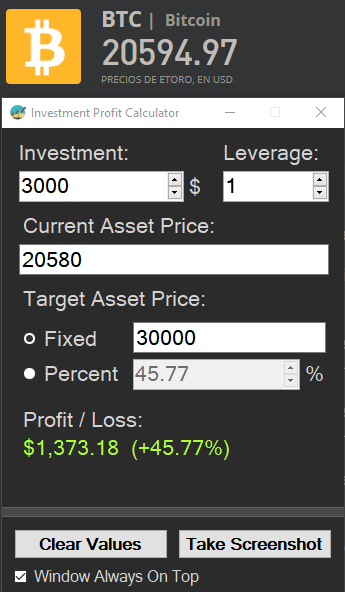
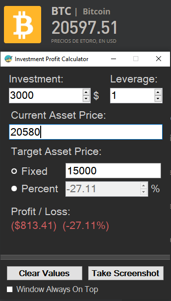
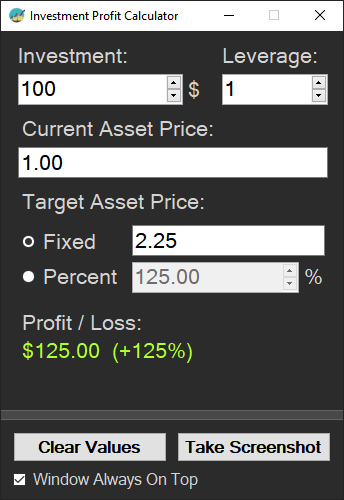

# Investment Profit & Loss Calculator

### A simple and basic Profit & Loss (P&L) calculator for your asset investments.

It can help you to calculate the potential gains or the risk of losses when operating in a investment platform, so it can help to define a investment strategy.

------------------

## 🖼️ Screenshots

  

## 📝 Requirements

- Microsoft Windows OS.

## 🤖 Getting Started

Download the latest extension release by clicking [here](https://github.com/ElektroStudios/Investment-Profit-Loss-Calculator/releases/latest),

## 🔄 Change Log

Explore the complete list of changes, bug fixes, and improvements across different releases by clicking [here](/Docs/CHANGELOG.md).

Once you have opened the program, you will see various controls where you can set the investment amount (that is, the money that you've invested), the leverage (if any), the current asset price that you invested in, and the target / expected asset price. The program will automatically calculate and show you the profit & loss whenever you modify those values.

## ⚠️ Disclaimer:

This Work (the repository and the content provided in) is provided "as is", without warranty of any kind, express or implied, including but not limited to the warranties of merchantability, fitness for a particular purpose and noninfringement. In no event shall the authors or copyright holders be liable for any claim, damages or other liability, whether in an action of contract, tort or otherwise, arising from, out of or in connection with the Work or the use or other dealings in the Work.

## 💪 Contributing

Your contribution is highly appreciated!. If you have any ideas, suggestions, or encounter issues, feel free to open an issue by clicking [here](https://github.com/ElektroStudios/Investment-Profit-Loss-Calculator/issues/new/choose). 

Your input helps make this Work better for everyone. Thank you for your support! 🚀

## 💰 Beyond Contribution 

This work is distributed for educational purposes and without any profit motive. However, if you find value in my efforts and wish to support and motivate my ongoing work, you may consider contributing financially through the following options:

 - ### Paypal:
    You can donate any amount you like via **Paypal** by clicking on this button:

    

 - ### Envato Market:
   If you are a .NET developer, you may want to explore '**DevCase Class Library for .NET**', a huge set of APIs that I have on sale.
   Almost all reusable code that you can find across my works is condensed, refined and provided through DevCase Class Library.

    Check out the product:
    
   

<u>**Your support means the world to me! Thank you for considering it!**</u> 👍
